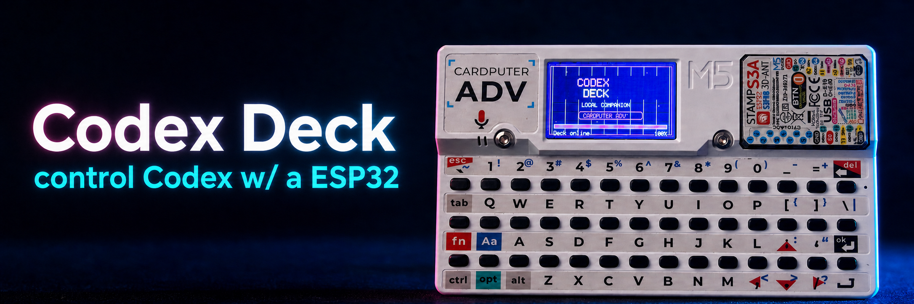
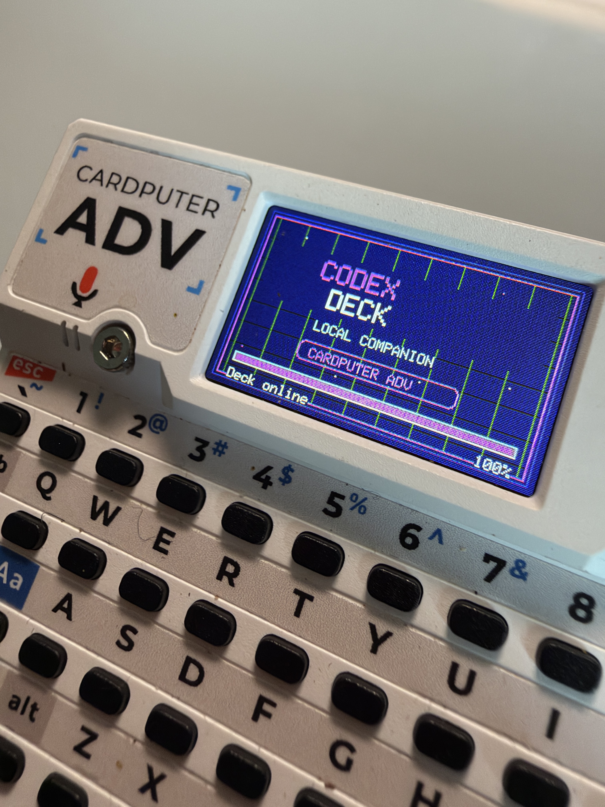
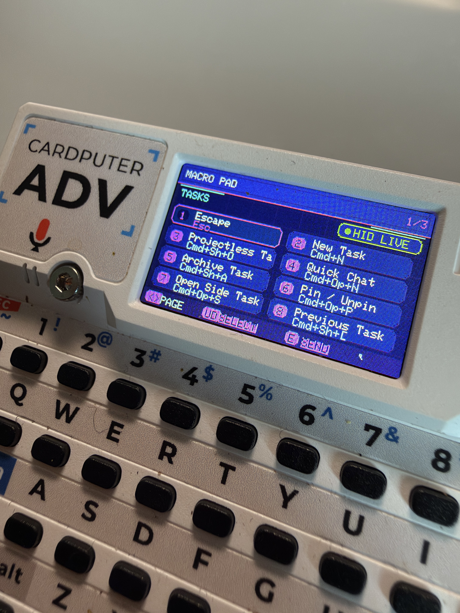
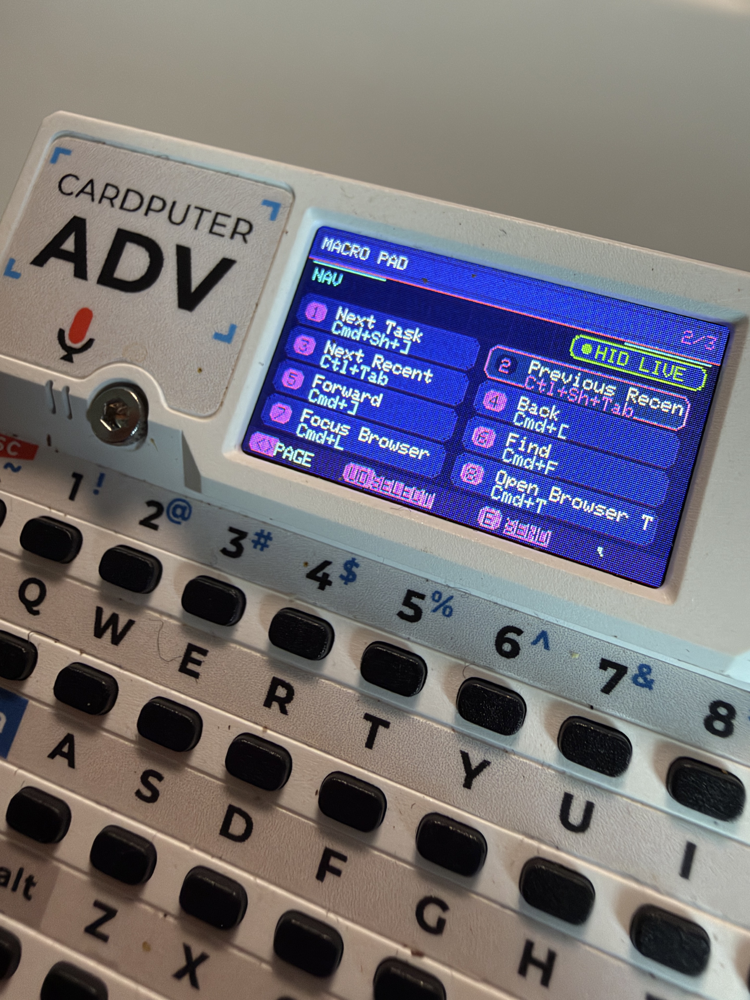
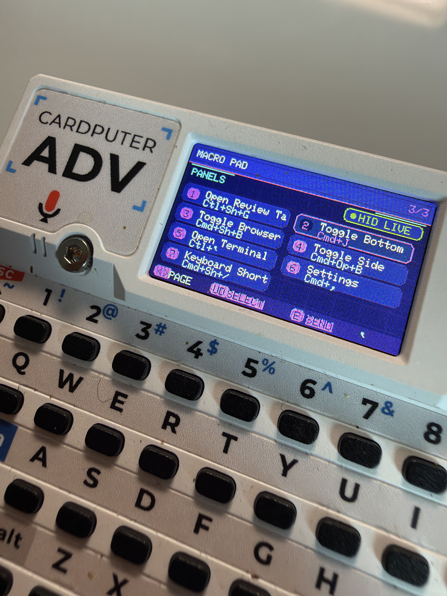
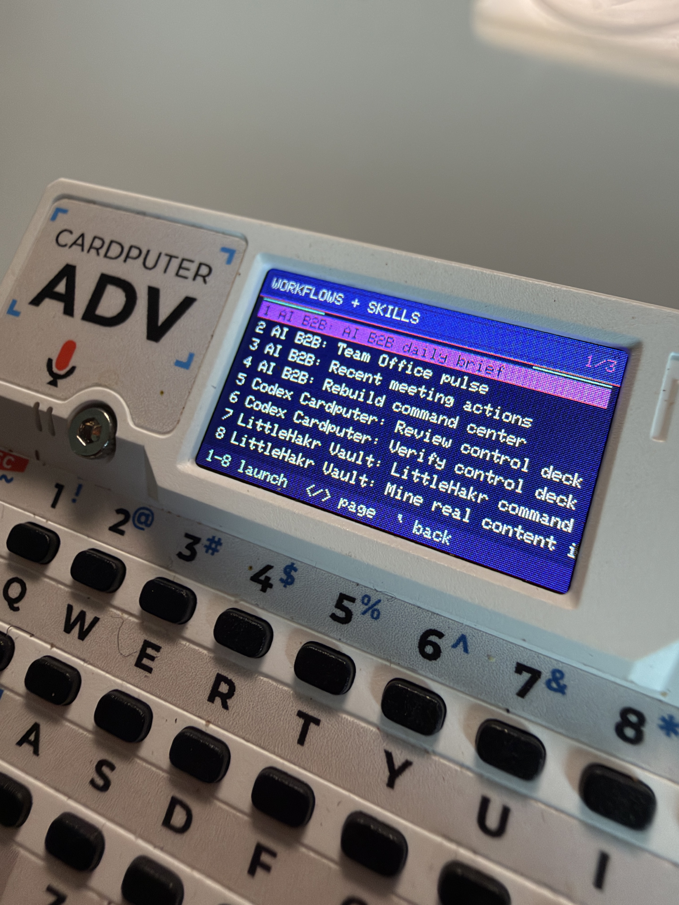

# CodexDeck for ESP32

<p align="center">
  
</p>

<p align="center">
  <strong>A small, local control deck for bridge-managed Codex work.</strong><br />
  Your Mac stays in control. Your ESP32 device becomes the focused status, approval, and task surface.
</p>

<p align="center">
  
  
  
</p>
<p align="center">
  
  
</p>

<p align="center"><em>CodexDeck on the M5Stack Cardputer ADV.</em></p>

## At a glance

- **Two ESP32 profiles:** M5Stack Cardputer ADV and Waveshare AMOLED 1.8 ESP32-S3.
- **Codex control surface:** launch allowlisted workflows or enabled skills, monitor task state, stop or steer turns, and send follow-ups.
- **Task-action macros:** each task can expose bounded actions such as review changes, run tests, commit changes, retry, approve, or reject.
- **USB or Bluetooth macro pad:** a 24-shortcut computer-control catalog across **Tasks**, **Navigation**, and **Panels**. Choose one persisted HID transport; shortcuts are never mirrored to both hosts.
- **Live status:** task attention, approvals, Wi-Fi, bridge health, and diagnostics stay visible on the device.
- **Local by design:** the Mac owns Codex, credentials, project allowlists, prompts, and approvals; the ESP32 receives compact, redacted state only.

> [!IMPORTANT]
> **Public preview.** CodexDeck is actively evolving and has not been released as a notarized public macOS app. It currently includes profiles for the **M5Stack Cardputer ADV** and the **Waveshare AMOLED 1.8 ESP32-S3**.

CodexDeck pairs a native macOS menu bar companion with a supported ESP32 control surface. The companion runs the local bridge and owns Codex App Server integration, project and workflow allowlists, prompts, approvals, and diagnostics. Each device sees only compact task state through the deliberately narrow `codexdeck.v1` protocol.

The ESP32 device never receives Codex credentials, raw terminal output, environment snapshots, or an arbitrary shell endpoint.

## Why it exists

Codex work is often easier to supervise when it is visible away from the terminal. CodexDeck puts the things that need your attention on a focused physical interface:

- Start an approved workflow or enabled Codex skill.
- Watch bridge-managed tasks, four at a time, with clear status and attention states.
- Stop, steer, or follow up on a running turn.
- Review command and file-change approvals from the device.
- Recover gracefully from Wi-Fi, bridge, WebSocket, or App Server interruption.

Tasks started outside the CodexDeck bridge are intentionally not monitored in v1.

## How it is built

```text
ESP32 device  <-->  constrained WebSocket protocol  <-->  local TypeScript bridge
                                                              |
                                                              v
                                                     codex app-server (local stdio)
                                                              |
                                                              v
                                                   native macOS menu bar companion
```

The Mac is the trust boundary. The bridge validates every device mutation, starts or resumes only allowlisted workflows, and keeps Codex App Server on local stdio. The device is a bounded input and display client, not a remote shell.

## Safety model

> [!WARNING]
> Version 1 has **no device authentication**. Use it only on a private, controlled Wi-Fi network. Never expose port `8765` through a tunnel, public listener, port forward, or cloud relay.

- The LAN protocol is intentionally constrained, but unauthenticated and trusted-network-only.
- Device approvals are limited to `accept`, `decline`, and `cancel`.
- Normal approvals require two presses; high-risk approvals require a 1.5-second hold.
- Structured `request_user_input` stays on the desktop.
- The device receives redacted, bounded summaries rather than prompts, raw output, project paths, or secrets.
- The companion-management API is loopback-only and protected by a per-launch token.

Read the full [security model](docs/security.md) before using the bridge on a network shared with anyone else.

## What works today

- Native macOS 13+ SwiftUI menu bar companion with setup, project/workflow management, diagnostics, and bridge lifecycle control.
- Local TypeScript bridge backed by `codex app-server --listen stdio://`.
- mDNS bridge discovery, saved private-host fallback, and reconnect handling.
- Cardputer ADV firmware with Wi-Fi setup, offline diagnostics, task views, task macros, follow-ups, and approval confirmation.
- Waveshare AMOLED 1.8 ESP32-S3 touch-first port that shares the bridge protocol and shortcut catalog; its current status is compile-ready.
- USB and bonded Bluetooth Low Energy keyboard output on both firmware profiles, with USB as the upgrade-safe default.
- Bounded task and frame handling: up to 20 tasks, four task rows at a time, an 8 KB frame limit, and a fixed 32 KB JSON arena.
- Allowlisted workflows and enabled skills, with strict configuration validation at the bridge boundary.

## Run the companion

### Everyday use

The packaged companion contains its Node runtime and bridge dependencies. Normal use does not require pnpm, Node, Arduino CLI, or an open terminal.

Build and open a local development-signed app:

```bash
pnpm package:mac
open build/macos/CodexDeck.app
```

At first launch, the companion imports existing local YAML configuration when available; otherwise it guides you through Codex sign-in and project selection. Its configuration lives in:

```text
~/Library/Application Support/CardPuter Codex Control Deck/
```

The current local build is development-signed. Public download distribution still needs a Developer ID Application certificate and Apple notarization.

### Development bridge

Requirements: Apple Silicon Mac on macOS 13+, Node.js 20+, pnpm 11, Codex CLI, Arduino CLI, and the board support package for the profile you want to build. A supported ESP32 device is required only for uploading and device verification.

```bash
pnpm install
cp apps/bridge/config/bridge.example.yaml apps/bridge/config/bridge.local.yaml
cp apps/bridge/config/workflows.example.yaml apps/bridge/config/workflows.local.yaml
./tools/start-bridge.sh
```

Edit `workflows.local.yaml` before starting the bridge. Every workflow `cwd` must be an existing absolute path. With no `bindHost`, the bridge chooses the first private IPv4 interface and falls back to `127.0.0.1`; set `bindHost: 127.0.0.1` when developing without a device.

The health endpoint is available at `http://HOST:8765/healthz`. Send `SIGHUP` to reload the workflow allowlist and enabled skill menu without interrupting active tasks.

## Firmware profiles

This repository uses **Arduino CLI only**. Select the profile that matches your hardware.

### M5Stack Cardputer ADV

```bash
arduino-cli compile --profile adv firmware/cardputer
arduino-cli board list
./tools/flash-firmware.sh /dev/cu.usbmodemXXXX
```

On first boot, the Cardputer opens Wi-Fi setup. Choose a network or press `M` for a hidden SSID. Credentials are masked and saved in ESP32 Preferences. From the offline screen, press `W` to reopen setup.

USB HID remains the default after installation or upgrade. To use Bluetooth,
press `S` to open Settings, select **HID**, choose **Bluetooth**, then pair
`CodexDeck Cardputer` in macOS Bluetooth settings. The selected transport is
saved across reboots. The HID screen also shows pairing readiness and provides
a confirmed **Clear BT Pairing** action.

Run the device assertion sketch with:

```bash
./tools/test-firmware.sh /dev/cu.usbmodemXXXX
```

It compiles, uploads, re-detects the modem, and watches serial output. A successful device-run result ends with `TEST SUMMARY ... failed=0`.

### Waveshare AMOLED 1.8 ESP32-S3

```bash
./tools/build-waveshare-amoled.sh
./tools/flash-waveshare-amoled.sh /dev/cu.usbmodemXXXX
```

This profile uses the 368×448 SH8601 AMOLED display and FT3168 touch controller. It shares CodexDeck's bridge protocol and shortcut catalog while using a touch-first interface. It is currently **compile-ready**; upload, display, and touch verification remain device-dependent. See [Waveshare target notes](docs/waveshare-amoled-18.md).

For Bluetooth HID, open **Settings**, tap **HID Status**, select
**Bluetooth**, and pair `CodexDeck AMOLED` in macOS Bluetooth settings. Select
USB on the same screen to stop BLE advertising and return shortcut output to
the wired host.

## Verify a checkout

```bash
pnpm verify
pnpm package:mac
pnpm mac:smoke
```

`pnpm verify` runs linting, formatting, TypeScript checks, bridge and protocol tests, production builds, Swift companion tests, compatibility checks, and both Arduino compile gates. See the [verification record](docs/verification.md) for the latest recorded results.

## Documentation

- [Architecture and trust boundary](docs/architecture.md)
- [Protocol](docs/protocol.md)
- [Security model](docs/security.md)
- [Mac companion checklist](docs/macos-companion-checklist.md)
- [Hardware test checklist](docs/hardware-test-checklist.md)
- [Troubleshooting](docs/troubleshooting.md)

## Proof states

CodexDeck uses precise proof language:

- **Compile-ready**: source compiles and automated gates pass; no device claim is implied.
- **Uploaded**: Arduino CLI reported a successful firmware upload to the named ESP32 profile.
- **Field-proven**: the relevant device checklist and recorded acceptance evidence were completed.

The banner shows a real Cardputer ADV running the CodexDeck interface. That visual demonstration does not replace the documented device test checklist or a field-proven claim for either profile.

## Contributing and public release

Issues and focused contributions are welcome as the project moves toward a public release. Keep changes within the safety model: supported ESP32 profiles only, local stdio for App Server, loopback-only management, strict protocol validation, and no credentials or arbitrary shell access on the device.

Before publishing a public binary, complete notarization, run the hardware checklist on the target device, and update the verification record with the resulting evidence.
